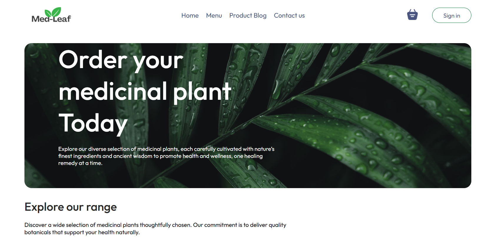
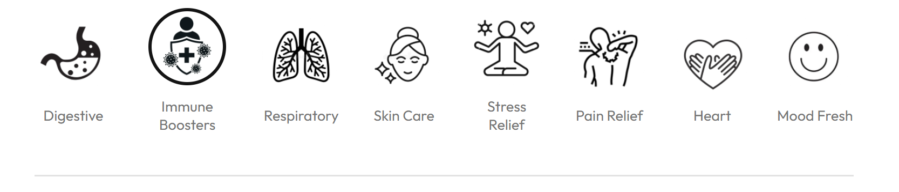
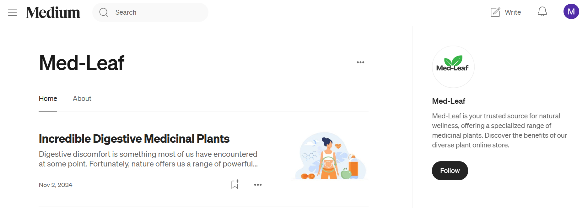
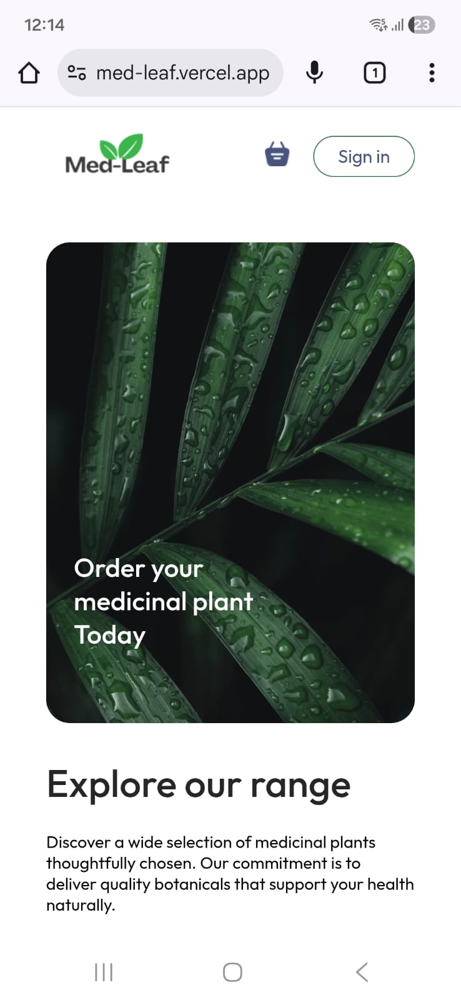
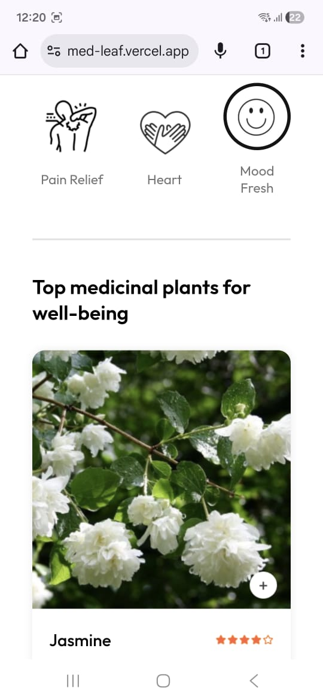
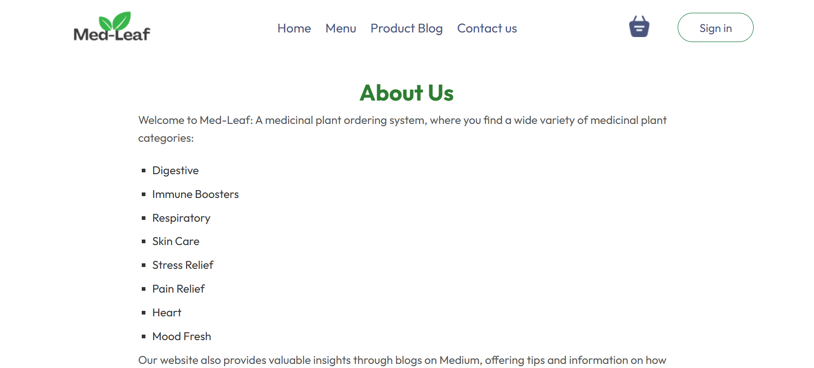

  

# Med-Leaf 🌿

Click here for Demo: [**Live Demo**](https://med-leaf.vercel.app/)

---

##  Overview

**Med-Leaf** is a responsive e-commerce platform for ordering **medicinal plants**, designed to connect users with natural remedies rooted in ancient wisdom. Built with **React.js**, the application provides an intuitive and engaging shopping experience through modern web technologies.

Each plant in our catalog is carefully categorized to promote **holistic well-being**, helping users explore the natural benefits of herbs across different health needs.

---

##  Importance of Medicinal Plants

Medicinal plants play a **vital role in our daily lives**, serving as a natural source of healing, wellness, and preventive care. From traditional remedies to modern herbal treatments, these plants contribute to:
- Boosting immunity and improving overall health.  
- Managing stress and enhancing mental well-being.  
- Supporting digestion, skin health, and respiratory function.  
- Providing sustainable, chemical-free alternatives to synthetic medicines.  

**Med-Leaf** bridges the gap between nature and modern living by helping users discover the healing power of plants in a digital and accessible way.

---

##  Key Features

Med-Leaf delivers a clean, intuitive, and functional shopping experience designed around both **usability** and **wellness education**.  
Each feature has been carefully crafted to improve discoverability, clarity, and and user trust.

##  1. Homepage — Clean & Welcoming Interface

  

<strong>Med-Leaf Homepage</strong>

The homepage acts as the user’s first touchpoint, offering a clean layout that clearly communicates the platform’s purpose. It highlights medicinal plant categories and provides direct access to learning content, ensuring users are introduced to both the shopping experience and educational aspects of Med-Leaf.

**Key aspects:**
- Minimal, wellness-themed UI  
- Prominent navigation for quick exploration  
- Smooth transitions into category-based browsing  

---

##  2. Category-Based Search — Explore Plants by Wellness Goals

  

<strong> Categories </strong>

Med-Leaf organizes all plants into well-defined **health categories**, enabling users to browse products based on specific physical or mental wellness outcomes.  
This structure helps users quickly find relevant plants without needing botanical knowledge.

**Why it matters:**
- Simplifies discovery for new users  
- Clear iconography improves scanning and navigation  
- Helps users match plants to their symptoms or goals  
- Reduces cognitive load with structured browsing paths  

**Categories include:**  
Digestive Aid, Immune Boosters, Respiratory Health, Skin Care, Stress Relief, Pain Relief, Heart Health, and Mood Fresh.

---
## 3. Product Display Cards — Clear, Informative & Easy to Interact With

  

<strong>Product Cards Preview</strong>

Med-Leaf showcases each medicinal plant using **well-structured product cards** that present all essential details at a glance.  
These cards are designed to help users quickly understand the benefits, price, and usage of each plant while maintaining a clean e-commerce aesthetic.

**Highlights of the product card design:**
- **High-quality plant images** for better visual identification  
- **Name and quick description** explaining the core benefit  
- **Clear pricing** displayed prominently in a readable format  
- **Add / Remove buttons** (with quantity selector) for smooth cart interaction  
- **Minimalist layout** ensuring the card looks clean and approachable  

This design mirrors industry-standard e-commerce cards, providing familiarity and ease of use for all types of users.

---

##  4. Persistent Shopping Cart — Seamless Shopping Continuity

  

<strong>Shopping Cart</strong>

The shopping cart is designed to maintain user selections throughout the browsing experience and even after refreshing or revisiting the page.  
This creates a frictionless and uninterrupted shopping flow.

**Feature strengths:**
- Items remain saved using browser persistence  
- Users can review, update, or remove items easily  
- Reduces user frustration and increases completion likelihood  
- Follows standard e-commerce usability patterns  

---

##  5. Medium Blog Integration — Learn as You Explore

  

<strong>Medium Blog post</strong>

Med-Leaf integrates educational content from Medium blogs to help users understand plant properties, health benefits, usage methods, and scientific backing.  
This creates a **knowledge-driven shopping experience**, helping users make informed purchasing decisions.

**Why this is impactful:**
- Builds credibility and user trust  
- Encourages learning-driven engagement  
- Complements the product experience with high-quality content  
- Strengthens the platform’s wellness-focused identity  

---

##  6. Mobile Responsive Design — Optimized for Every Device

   &nbsp;&nbsp;&nbsp;&nbsp;&nbsp;&nbsp;&nbsp; 
  

<strong>Mobile Preview</strong>

A fully responsive layout ensures Med-Leaf works seamlessly on:
- Smartphones  
- Tablets  
- Desktops  

**Responsive Design Benefits:**
- Mobile-first UI ensures usability on small screens  
- Flexible grid systems and adaptive layouts  
- Reliable navigation across touch-based devices  
- Improved accessibility and user retention  

---

##  7. About Us — Story, Purpose & Platform Identity

   

<strong>About us Preview</strong>

The **About Us** page communicates the inspiration behind Med-Leaf, highlighting the platform’s mission of reconnecting users with nature through accessible digital tools.  
It explains the reasoning behind promoting herbal wellness and the vision that shaped the platform.

**Purpose of this section:**
- Builds transparency and authenticity  
- Explains the mission behind promoting herbal wellness  
- Helps users understand the vision and origin of Med-Leaf  
- Creates a personal connection with the platform  

---
 

##  Tech Stack

| Technology | Purpose |
|-------------|----------|
| **HTML** | Structure and semantic layout |
| **CSS** | Styling and responsive design |
| **JavaScript (ES6+)** | Interactivity and logic |
| **React.js** | Front-end architecture and component reusability |

---

## Learning Outcomes

- Developed component-based architecture for scalability.  
- Enhanced UX through state management and dynamic rendering.  
- Improved accessibility and performance across multiple devices.  
- Built external educational integration for increased user engagement.  
- Understood the practical value of medicinal plants and their impact on wellness.  

