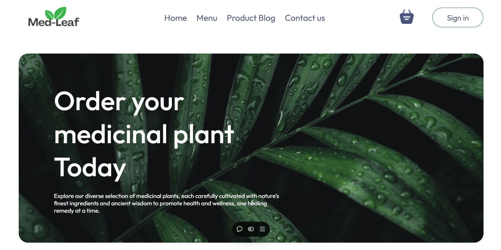

  

# Med-Leaf 🌿

Click here for Demo: [**Live Demo**](https://med-leaf.vercel.app/)

---

##  Overview

**Med-Leaf** is a responsive e-commerce platform for ordering **medicinal plants**, designed to connect users with natural remedies rooted in ancient wisdom. Built with **React.js**, the application provides an intuitive and engaging shopping experience through modern web technologies.

Each plant in our catalog is carefully categorized to promote **holistic well-being**, helping users explore the natural benefits of herbs across different health needs.

---

##  Importance of Medicinal Plants

Medicinal plants play a **vital role in our daily lives**, serving as a natural source of healing, wellness, and preventive care. From traditional remedies to modern herbal treatments, these plants contribute to:
- Boosting immunity and improving overall health.  
- Managing stress and enhancing mental well-being.  
- Supporting digestion, skin health, and respiratory function.  
- Providing sustainable, chemical-free alternatives to synthetic medicines.  

**Med-Leaf** bridges the gap between nature and modern living by helping users discover the healing power of plants in a digital and accessible way.

---

##  Project Highlights

- **Architected a Responsive Front-End** using **React.js**, implementing a modular structure with reusable components for better maintainability and scalability.  
- **Dynamic Search Functionality** enables users to find medicinal plants quickly and intuitively.  
- **Persistent Shopping Cart** ensures users can continue their shopping journey without losing selections between sessions.  
- **Educational Medium Blog Integration** — linked directly from the platform — offers articles on medicinal plant benefits, creating a knowledge hub that **builds user trust and engagement**.  
- Fully **responsive UI** ensures seamless performance on desktops, tablets, and smartphones.  

---

##  Key Features

- **Home Page:** Engaging introduction with navigation to various plant categories.  
- **Category Pages:** Specialized collections for different health benefits, including:
  - Digestive Aid  
  - Immune Boosters  
  - Respiratory Health  
  - Skin Care  
  - Stress Relief  
  - Pain Relief  
  - Heart Health  
  - Mood Fresh  
- **🔍 Dynamic Search:** Quickly locate desired plants using search filters.  
- **🛒 Persistent Shopping Cart:** Retains user selections even after page refreshes.  
- **📖 Linked Medium Blog:** Provides educational content about plant usage and benefits.  

---

##  Tech Stack

| Technology | Purpose |
|-------------|----------|
| **HTML** | Structure and semantic layout |
| **CSS** | Styling and responsive design |
| **JavaScript (ES6+)** | Interactivity and logic |
| **React.js** | Front-end architecture and component reusability |

---

## Learning Outcomes

- Developed component-based architecture for scalability.  
- Enhanced UX through state management and dynamic rendering.  
- Improved accessibility and performance across multiple devices.  
- Built external educational integration for increased user engagement.  
- Understood the practical value of medicinal plants and their impact on wellness.  

